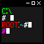

# promptstyle

## About

promptstyle is a simple [Batch script](https://en.wikipedia.org/wiki/Batch_script) that allows you to change the style of the prompt text in your Command Prompt.

promptstyle ships with a couple of styles which you can see in the cover image above.

## Note

Prompt styles showcased above may differ on your configuration depending on the font and color scheme used.

Keep in mind that older versions of Command Prompt did not support ANSI escape code colors so the styles here may only affect the text position and not the color.

## Contributing

To contribute your own prompt style, open a new issue starting with `contrib: style` and it will be merged, you will be credited.

## Issues

If you need to report a problem with a specific style or the styles not working at all, open a new issue starting with `issue: description` and I'll try to get to it as soon as I can.
